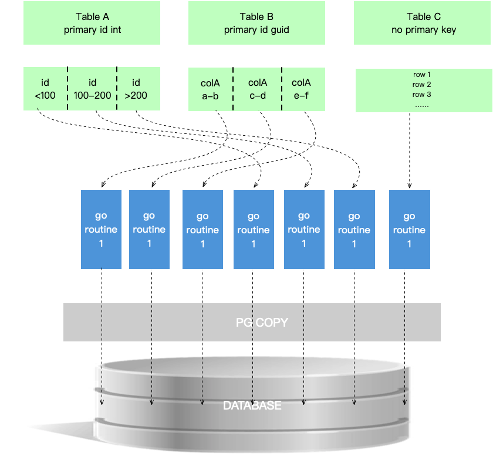

# gomysql2pg


([CN](https://github.com/iverycd/gomysql2pg/blob/master/readme_cn.md))

## 1. Overview & Features

### 1.1 Features

One-click migration from `MySQL` to `PostgreSQL`-kernel databases, including `PostgreSQL`, `Vastbase`, `Huawei GaussDB`, `TelePG`, `Kingbase V8R6`, `HighGo`, and more.

- No cumbersome deployment — ready to use out of the box, compact and lightweight
- Batch migration of multiple database pairs (e.g. 100 source-destination pairs) in a single run
- Online migration of tables, views, indexes, foreign keys, auto-increment columns, and other objects
- Multiple goroutines migrate data concurrently, fully utilizing CPU multi-core performance
- Supports migrating a subset of tables from the source database
- Records migration logs and dumps SQL statements for DDL object creation failures
- One-click migration from MySQL to PostgreSQL — convenient, fast, and easy to use





MySQL and PostgreSQL-kernel databases differ significantly in architecture, table structure, column types, auto-increment implementation, functions, stored procedures, and more. Importing a traditional SQL backup file into the target database is both impractical and inefficient.

This tool reduces the manual effort involved in heterogeneous database migration and concurrently migrates the majority of MySQL objects — table structures, auto-increment columns, views, row data, and more — to the target database with maximum compatibility. It supports full-database migration, object-level migration, and custom SQL query migration.

### 1.2 Pre-requirements

The client machine running the tool must be able to connect to both the source MySQL database and the target database simultaneously.

Supported platforms: Windows, Linux, macOS.

### 1.3 Installation

Extract the archive and run the tool directly.

On Linux:

```bash
[root@localhost opt]# tar -zxvf gomysql2pg-linux64-0.1.7.tar.gz
```

---

## 2. Single Database Migration

The examples below use Windows. Command-line parameters are identical on other operating systems.

> **Note:** On Windows, run this tool in `CMD`. On macOS or Linux, run it from a directory where you have read/write permissions.

### 2.1 Edit the configuration file

Edit `example.yml` and fill in the source and destination database connection details:

```yaml
src:
  host: 192.168.1.3
  port: 3306
  database: test
  username: root
  password: 11111
dest:
  dbType: Gauss # Add this line only when using openGauss, GaussDB, or HighGo (values: Gauss / Highgo); comment it out for all other database types
  host: 192.168.1.200
  port: 5432
  database: test
  username: test
  password: 11111
pageSize: 100000
maxParallel: 30
charInLength: false
useNvarchar2: false
Distributed: false
tables:
  test1:
    - select * from test1
  test2:
    - select * from test2
exclude:
  - 'log1'
  - 'log2'
  - '*_log'
  - '*_cswysk'
```

**Configuration parameters:**

- `pageSize`: Number of records per page for paginated queries.
  ```sql
  -- e.g. pageSize: 100000
  SELECT t.* FROM (SELECT id FROM test ORDER BY id LIMIT 0, 100000) temp LEFT JOIN test t ON temp.id = t.id;
  ```
- `maxParallel`: Maximum number of goroutines to run concurrently.
- `tables`: Custom tables to migrate and their query SQL, indented in YAML format.
- `exclude`: Tables to skip; indented in YAML format; supports wildcard `*`, e.g. `test*`.
- `charInLength`: If `true`, `varchar` length is measured in characters instead of bytes (compatible with select databases such as Vastbase).
- `useNvarchar2`: If `true`, the target database uses the `nvarchar2` type (e.g. GaussDB).
- `Distributed`: Default `false` (non-distributed). Set to `true` for distributed databases (e.g. GaussDB 8.1.3); the tool will change the table distribution column to the primary key column before adding the primary key.
- `schemaMapping`: Optional. Cross-schema reference mapping rules for view SQL (key = MySQL source schema name, value = PG target schema name; an empty string value removes the prefix). Affects view migration only — does not affect tables or data.

### 2.2 Full database migration

Migrates all table structures, row data, views, index constraints, auto-increment columns, and other objects.

> **Note for openGauss / GaussDB targets:** Two options make `varchar` lengths behave the same as MySQL (character-based):
>
> - **Option 1**: Set `useNvarchar2: true` in the config — the tool will use `nvarchar2` on the target (GaussDB supports character-length storage for this type).
> - **Option 2**: Create the database with a MySQL or PG compatibility mode:
>   ```sql
>   create database test owner test DBCOMPATIBILITY='B';
>   -- or
>   create database test owner test DBCOMPATIBILITY='PG';
>   ```

```bash
# Windows
gomysql2pg.exe --config example.yml

# Linux / macOS
./gomysql2pg --config example.yml
```

### 2.3 Migration modes

In addition to full-database migration, the tool supports migrating specific database objects via subcommands.

| Subcommand / Flag | Description |
|---|---|
| *(none)* | Full migration: table structures, row data, views, indexes, auto-increment columns, and all other objects |
| `-s` | Custom SQL migration: migrates only the tables defined in `tables` (structure + data) |
| `createTable -t` | Create all table structures on the target (no row data) |
| `createTable -s -t` | Create only the custom table structures defined in the config |
| `onlyData` | Migrate row data for all tables (no table structures) |
| `onlyData -s` | Migrate row data for custom SQL tables only (no table structures) |
| `seqOnly` | Convert MySQL auto-increment columns to target database sequences |
| `idxOnly` | Migrate primary keys, indexes, and other constraints |
| `viewOnly` | Migrate views only |
| `dryRun` | Pre-flight check: read-only validation, no objects created, no data migrated |

**Examples (Windows):**

```bash
gomysql2pg.exe --config example.yml              # Full migration
gomysql2pg.exe --config example.yml -s           # Custom SQL migration
gomysql2pg.exe --config example.yml createTable -t      # Table structures only (all)
gomysql2pg.exe --config example.yml createTable -s -t   # Table structures only (custom)
gomysql2pg.exe --config example.yml onlyData     # Row data only (all tables)
gomysql2pg.exe --config example.yml onlyData -s  # Row data only (custom)
gomysql2pg.exe --config example.yml seqOnly      # Auto-increment / sequences only
gomysql2pg.exe --config example.yml idxOnly      # Indexes and constraints only
gomysql2pg.exe --config example.yml viewOnly     # Views only
gomysql2pg.exe --config example.yml dryRun       # Pre-flight check
```

On Linux / macOS replace `gomysql2pg.exe` with `./gomysql2pg`.

**DryRun details:**

Pre-flight mode performs only three read-only checks — no objects are created, no data is migrated:

1. `SourcePing`: ping the source MySQL.
2. `DestPing`: ping the destination database (driver auto-selected from `dest.dbType`).
3. `SameNameSchema`: verify that a schema matching `dest.username` exists on the destination.

Exit code is `0` when all checks pass; `1` otherwise. Failure details are written to `log/<timestamp>__src__to__dest/dryRunFailed.log`.

If `SameNameSchema` reports `no schema named "<user>" in database "<db>"`, run the following on the destination as a privileged user:

```sql
create user <user> with password '123456';
create schema <user> authorization <user>;
```

Replace `<user>` with `dest.username` from the yml and `'123456'` with the real password.

---

## 3. Batch Migration (Multiple Databases)

Use case: migrate multiple databases / source-destination pairs in a single run. Two scripts at the repo root provide identical behavior, prompts, log format, and exit codes: `run_batch.sh` (Linux / macOS) and `run_batch.ps1` (Windows).

### 3.1 Generate configuration files

Edit the Excel file `configs/example.xlsx`, entering the correct connection details under each column header (`src_*` columns for the source, `dest_*` for the destination).

Required header columns (first row, case-insensitive): `src_host`, `src_port`, `src_database`, `src_username`, `src_password`, `dest_host`, `dest_port`, `dest_database`, `dest_username`, `dest_password`.

- Output files are named `NNN_<src_database>.yml` in row order.
- Existing files are skipped by default (use `--overwrite` to replace them).
- Duplicate rows abort the run.

Use the `tools/xlsx2yml` utility to generate yml config files from the workbook:

```bash
# Development (source)
go run ./tools/xlsx2yml                              # reads configs/example.xlsx -> configs/
go run ./tools/xlsx2yml -f my.xlsx -o out_dir        # custom input file and output directory
go run ./tools/xlsx2yml --sheet Sheet2 --overwrite   # specify sheet, overwrite existing yml
go run ./tools/xlsx2yml --schema-mapping             # also emit schemaMapping: { src_db: dest_user }

# Pre-built binary
xlsx2yml.exe                              # reads configs/example.xlsx -> configs/
xlsx2yml.exe -f my.xlsx -o out_dir
xlsx2yml.exe --sheet Sheet2 --overwrite
xlsx2yml.exe --schema-mapping
```

After running, the `configs/` directory will contain one yml per database:

```
configs/
├── 001_db_1.yml
├── 002_db_2.yml
└── 003_db_3.yml
```

### 3.2 Dry-run pre-flight

Run a `dryrun` pass before the real migration to catch connectivity and missing-schema problems in one shot.

**Script behavior:**

1. Calls `gomysql2pg --config <file> dryRun` for each yml — three read-only checks per config: source MySQL ping, destination ping, same-name schema check.
2. No objects are created, no data is migrated; the interactive `yes` confirmation is skipped.
3. Batch log is named `batch-dryrun-YYYYMMDD-HHMMSS.log`. Each failing config also writes `dryRunFailed.log` under `log/<timestamp>__src__to__dest/` (picked up by `check_log.sh` / `check_log.ps1`).
4. If any config fails due to a missing same-name schema, a remediation SQL block is printed to the terminal and written to the batch log after the run completes — ready to copy and paste:

```
=== missing same-name schema(s) detected ===
Run the following SQL on the destination database as a privileged user:

create user admin2 with password '123456';
create schema admin2 authorization admin2;

(Replace '123456' with a real password before executing.)
```

**Linux / macOS:**

```bash
bash run_batch.sh configs dryrun
```

**Windows (PowerShell 5.1+, built into Windows):**

First-time setup — grant PowerShell script execution permission (run PowerShell as Administrator):

```powershell
Set-ExecutionPolicy RemoteSigned -Scope CurrentUser -Force
Get-ExecutionPolicy -List
```

Then run the pre-flight check:

```powershell
cd C:\db_tool\gomysql2pg-win-x64-v0.2.10
.\run_batch.ps1 configs dryrun
```

Sample output when all checks pass:

```
=== batch done 2026-05-15 15:00:51 ===
success: 3
  OK   C:\db_tool\gomysql2pg-win-x64-v0.2.10\configs\01_a.yml
  OK   C:\db_tool\gomysql2pg-win-x64-v0.2.10\configs\02_b.yml
  OK   C:\db_tool\gomysql2pg-win-x64-v0.2.10\configs\03_c.yml
failed:  0
```

### 3.3 Run batch migration

**Script behavior:**

1. Prints a preview: `[i] file | src=host:port/db -> dest=user@host:port/db`.
2. Waits for the user to enter `yes` before running; any other input aborts (exit code 1).
3. Runs `gomysql2pg --config <file>` sequentially; a single failure does not abort the rest.
4. All output is teed to the screen and to a batch log `batch-YYYYMMDD-HHMMSS.log`.
5. Prints a final success / failed summary. **Exit code equals the number of failed configs** (0 on full success).

**Linux / macOS:**

```bash
bash run_batch.sh                       # default: reads configs/ directory
bash run_batch.sh path/to/cfg_dir       # custom directory
```

Sample run:

```
cd gomysql2pg-linux-x64-v0.2.10

bash run_batch.sh

Found 3 config(s) to migrate:
[1] configs/01_a.yml  |  src=192.168.1.86:3306/db_a101  ->  dest=admin@192.168.1.95:5432/test
[2] configs/02_b.yml  |  src=192.168.1.86:3306/db_a102  ->  dest=admin2@192.168.1.95:5432/test
[3] configs/03_c.yml  |  src=192.168.1.86:3306/db_a999  ->  dest=admin3@192.168.1.95:5432/test

Proceed with these 3 migration(s)? [yes/no]: -> type yes or no to continue or exit
```

**Windows (PowerShell 5.1+):**

```powershell
.\run_batch.ps1                              # default: reads configs/ directory
.\run_batch.ps1 -ConfigDir my_cfgs           # custom directory
```

Sample run:

```
PS C:\db_tool\gomysql2pg-win-x64-v0.2.10> .\run_batch.ps1
Found 3 config(s) to migrate:
  [1] C:\db_tool\gomysql2pg-win-x64-v0.2.10\configs\01_a.yml  |  src=192.168.1.86:3306/db_a101  ->  dest=admin@192.168.1.95:5432/test
  [2] C:\db_tool\gomysql2pg-win-x64-v0.2.10\configs\02_b.yml  |  src=192.168.1.86:3306/db_a102  ->  dest=admin2@192.168.1.95:5432/test
  [3] C:\db_tool\gomysql2pg-win-x64-v0.2.10\configs\03_c.yml  |  src=192.168.1.86:3306/db_a999  ->  dest=admin3@192.168.1.95:5432/test

Proceed with these 3 migration(s)? [yes/no]: -> type yes or no to continue or exit
```

### 3.4 Check migration logs

After batch migration, use `check_log.sh` / `check_log.ps1` to scan the `log/` directory and quickly summarize which databases migrated cleanly and which have failures or warnings — without manually browsing each subdirectory.

**Linux / macOS:**

```bash
bash check_log.sh           # default: scans log/ directory
bash check_log.sh other_log # custom log directory
```

**Windows (PowerShell):**

```powershell
.\check_log.ps1               # default: scans log/
.\check_log.ps1 -LogDir other_log  # custom directory
```

**Sample output:**

```
Scanning log directory: log/

[OK]   2026_05_10_09_00_00__192.168.1.86__to__192.168.1.95
[WARN] 2026_05_10_09_05_00__192.168.1.86__to__192.168.1.95
       invalidTableData.log               (3 lines)

[FAIL] 2026_05_10_09_10_00__192.168.1.86__to__192.168.1.95
       tableCreateFailed.log              (5 lines)
       viewCreateFailed.log               (2 lines)
       invalidTableData.log               (1 lines) [WARN]

--- Summary ---
Total:   3
Failed:  1
OK:      2
```

**Tag meanings:**

| Tag | Meaning |
|---|---|
| `[OK]` | No failure or warning files — migration completed cleanly |
| `[WARN]` | Only `invalidTableData.log` present — some row data was invalid (e.g. non-convertible characters); all other objects migrated successfully |
| `[FAIL]` | One or more failure log files present — file names and line counts are shown; manual investigation required |

**Failure log files detected:**

`tableCreateFailed.log`, `seqCreateFailed.log`, `idxCreateFailed.log`, `DistributedAlterFailed.log`, `FkCreateFailed.log`, `viewCreateFailed.log`, `TriggerCreateFailed.log`, `failedTable.log`, `errorTableData.log`, `dryRunFailed.log`

**Exit code:** equals the number of `[FAIL]` directories (0 when all pass) — suitable for use in CI/CD pipelines to determine whether batch migration succeeded.

---

## 4. Migration Summary

After full-database migration completes, a summary is generated. Check it for any failed objects; query the migration log to investigate failures.

```
+-------------------------+---------------------+-------------+----------+
|        SourceDb         |       DestDb        | MaxParallel | PageSize |
+-------------------------+---------------------+-------------+----------+
| 192.168.149.37-sourcedb | 192.168.149.33-test |     30      |  100000  |
+-------------------------+---------------------+-------------+----------+

+------------+----------------------------+----------------------------+-------------+---------------+
|Object      |         BeginTime          |          EndTime           |FailedTotal  |ElapsedTime    |
+------------+----------------------------+----------------------------+-------------+---------------+
|TableData   | 2023-07-11 12:23:55.584092 | 2023-07-11 12:28:44.105372 |6            |4m48.5212802s  |
|Sequence    | 2023-07-11 12:30:04.697570 | 2023-07-11 12:30:12.549534 |1            |7.8519647s     |
|Index       | 2023-07-11 12:30:12.549534 | 2023-07-11 12:33:45.312366 |5            |3m32.7628317s  |
|ForeignKey  | 2023-07-11 12:33:45.312366 | 2023-07-11 12:34:00.413767 |0            |15.1014013s    |
|View        | 2023-07-11 12:34:00.413767 | 2023-07-11 12:34:01.240472 |14           |826.705ms      |
|Trigger     | 2023-07-11 12:34:01.240472 | 2023-07-11 12:34:01.339078 |1            |98.6061ms      |
+------------+----------------------------+----------------------------+-------------+---------------+

Table Create finish elapsed time  5.0256021s
time="2023-07-11T12:34:01+08:00" level=info msg="All complete totalTime 10m30.1667987s\nThe Report Dir C:\\go\\src\\gomysql2pg\\2023_07_11_12_23_31"
```

---

## 5. Compare Source and Target Database

After migration, compare row counts between the source and destination to identify any tables with missing data.

```bash
# Windows
gomysql2pg.exe --config example.yml compareDb

# Linux / macOS
./gomysql2pg --config example.yml compareDb
```

Sample output (only mismatched tables are shown):

```
Table Compare Result (Only Not Ok Displayed)
+-----------------------+------------+----------+-------------+------+
|Table                  |SourceRows  |DestRows  |DestIsExist  |isOk  |
+-----------------------+------------+----------+-------------+------+
|abc_testinfo           |7458        |0         |YES          |NO    |
|log1_qweharddiskweqaz  |0           |0         |NO           |NO    |
|abcdef_jkiu_button     |4           |0         |YES          |NO    |
|abcdrf_yuio            |5           |0         |YES          |NO    |
|zzz_ss_idcard          |56639       |0         |YES          |NO    |
|asdxz_uiop             |290497      |190497    |YES          |NO    |
|abcd_info              |1052258     |700000    |YES          |NO    |
+-----------------------+------------+----------+-------------+------+
INFO[0040] Table Compare finish elapsed time 11.307881434s
```

---

## 6. Version History

| Version | Date | Key Changes |
|---|---|---|
| v0.2.7.1 | 2026-04-15 | Added mapping support for `binary`/`tinyblob`/`blob`/`mediumblob`/`longblob` to `bytea` |
| v0.2.8 | 2026-04-15~16 | Automatic view SQL adaptation: charset handling, schema prefix removal / rename |
| v0.2.8.1 | 2026-05-11 | Fixed migration summary (Summary) output |
| v0.2.8.2 | 2026-05-11 | Improved log formatting and completeness |
| v0.2.9 | 2026-05-11~12 | Added batch migration scripts `run_batch.sh` (Linux/macOS) and `run_batch.ps1` (Windows) |
| v0.2.10 | 2026-05-13~14 | Added Excel config generator (`tools/xlsx2yml`); added `schemaMapping` config option; added `dryRun` pre-flight mode; added log scanning scripts `check_log.sh` / `check_log.ps1`; fixed destination database connection compatibility |
