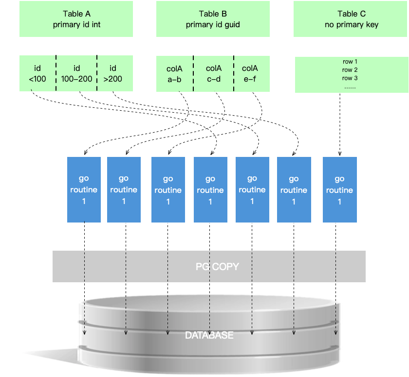

# gomysql2pg


## 一、工具特性以及环境要求
### 1.1 功能特性

支持MySQL数据库一键迁移到postgresql内核类型的目标数据库，如postgresql数据库、海量数据库vastbase、华为postgresql、电信telepg、人大金仓Kingbase V8R6等

- 无需繁琐部署，开箱即用，小巧轻量化

- 在线迁移MySQL到目标数据库的表、视图、索引、外键、自增列等对象

- 多个goroutine并发迁移数据，充分利用CPU多核性能

- 支持迁移源库部分表功能

- 记录迁移日志，转储表、视图等DDL对象创建失败的sql语句

- 一键迁移MySQL到postgresql，方便快捷，轻松使用




需要知道的是MySQL跟其他基于pgsql内核或者协议的国产数据库，无论是数据库架构还是在表结构以及列类型，自增列实现方式，函数，存储过程等多个对象存在很多差异，如果通过传统的SQL备份文件导入到目标数据库，这势必是不可取也是最没效率的一种方式

通过此工具，可以降低异构数据库之间开发的人工成本，并尽可能的将MySQL绝大多数的,表结构，自增列，视图，行数据等多对象并发迁移到目标数据库，尽可能的适配目标类型，提供了全库级别，表对象级，自定义查询SQL等多种迁移方式

gomysql2pg根据MySQL内部的数据字典获取到数据库各个对象的定义和属性信息，并适配到目标数据库

数据迁移，本质上就是把表数据从一个数据库"搬家"到另一个数据库，其中主要涉及读表，传输，写表，而读表和写表占据迁移绝大多数时间

### 1.2 环境要求
在运行的客户端PC需要同时能连通源端MySQL数据库以及目标数据库

支持Windows、Linux、MacOS

### 1.3 如何安装

解压之后即可运行此工具

若在Linux环境下请使用tar解压，例如：


`[root@localhost opt]# tar -zxvf gomysql2pg-linux64-0.1.7.tar.gz`

## 二、使用方法

以下为Windows平台示例，其余操作系统命令行参数一样

`注意:`在`Windows`系统请在`CMD`运行此工具，如果是在`MacOS`或者`Linux`系统，请在有读写权限的目录运行

### 2.1 编辑yml配置文件

编辑`example.cfg`文件，分别输入源库跟目标数据库信息

```yaml
src:
  host: 192.168.1.3
  port: 3306
  database: test
  username: root
  password: 11111
dest:
  host: 192.168.1.200
  port: 5432
  database: test
  username: test
  password: 11111
pageSize: 100000
maxParallel: 30
charInLength: false
useNvarchar2: false
Distributed: false
tables:
  test1:
    - select * from test1
  test2:
    - select * from test2
exclude:
  operalog1
  operalog2
  operalog3

```

pageSize: 分页查询每页的记录数
```
e.g.
pageSize:100000
SELECT t.* FROM (SELECT id FROM test  ORDER BY id LIMIT 0, 100000) temp LEFT JOIN test t ON temp.id = t.id;
```
- maxParallel: 最大能同时运行goroutine的并发数

- tables: 自定义迁移的表以及自定义查询源表，按yml格式缩进

- exclude: 不需要迁移的表，按yml格式缩进

- charInLength: 如果是true，varchar类型存储的是字符长度而不是字节，所以仅兼容部分数据库(例如海量)

- useNvarchar2: 如果是true，目标数据库使用nvarchar2类型(例如GaussDB)

- Distributed: 默认为false即非分布式数据库，如果是分布式数据库就写true，如GaussDB 8.1.3，在增加主键之前，先更改表分布列为主键的列，随后再增加主键

### 2.2 全库迁移

迁移全库表结构、行数据，视图、索引约束、自增列等对象

gomysql2pg.exe  --config 配置文件
```
示例
gomysql2pg.exe --config example.yml

如果是Linux或者macOS请在终端运行
./gomysql2pg --config example.yml
```

### 2.3 查看迁移摘要

全库迁移完成之后会生成迁移摘要，观察下是否有失败的对象，通过查询迁移日志可对迁移失败的对象进行分析

```bash
+-------------------------+---------------------+-------------+----------+
|        SourceDb         |       DestDb        | MaxParallel | PageSize |
+-------------------------+---------------------+-------------+----------+
| 192.168.149.37-sourcedb | 192.168.149.33-test |     30      |  100000  |
+-------------------------+---------------------+-------------+----------+

+------------+----------------------------+----------------------------+-------------+---------------+
|Object      |         BeginTime          |          EndTime           |FailedTotal  |ElapsedTime    |
+------------+----------------------------+----------------------------+-------------+---------------+
|TableData   | 2023-07-11 12:23:55.584092 | 2023-07-11 12:28:44.105372 |6            |4m48.5212802s  |
|Sequence    | 2023-07-11 12:30:04.697570 | 2023-07-11 12:30:12.549534 |1            |7.8519647s     |
|Index       | 2023-07-11 12:30:12.549534 | 2023-07-11 12:33:45.312366 |5            |3m32.7628317s  |
|ForeignKey  | 2023-07-11 12:33:45.312366 | 2023-07-11 12:34:00.413767 |0            |15.1014013s    |
|View        | 2023-07-11 12:34:00.413767 | 2023-07-11 12:34:01.240472 |14           |826.705ms      |
|Trigger     | 2023-07-11 12:34:01.240472 | 2023-07-11 12:34:01.339078 |1            |98.6061ms      |
+------------+----------------------------+----------------------------+-------------+---------------+

Table Create finish elapsed time  5.0256021s
time="2023-07-11T12:34:01+08:00" level=info msg="All complete totalTime 10m30.1667987s\nThe Report Dir C:\\go\\src\\gomysql2pg\\2023_07_11_12_23_31" func=gomysql2pg/cmd.mysql2pg file="C:/go/src/gomysql2pg/cmd/root.go:207"

```

### 2.4 比对数据库

迁移完之后比对源库和目标库，查看是否有迁移数据失败的表

`windows使用:gomysql2pg.exe --config your_file.yml compareDb`

```
e.g.
gomysql2pg.exe --config example.yml compareDb

在Linux，MacOS使用示例如下
./gomysql2pg --config example.yml compareDb
```

```bash
Table Compare Result (Only Not Ok Displayed)
+-----------------------+------------+----------+-------------+------+
|Table                  |SourceRows  |DestRows  |DestIsExist  |isOk  |
+-----------------------+------------+----------+-------------+------+
|abc_testinfo           |7458        |0         |YES          |NO    |
|log1_qweharddiskweqaz  |0           |0         |NO           |NO    |
|abcdef_jkiu_button     |4           |0         |YES          |NO    |
|abcdrf_yuio            |5           |0         |YES          |NO    |
|zzz_ss_idcard          |56639       |0         |YES          |NO    |
|asdxz_uiop             |290497      |190497    |YES          |NO    |
|abcd_info              |1052258     |700000    |YES          |NO    |
+-----------------------+------------+----------+-------------+------+ 
INFO[0040] Table Compare finish elapsed time 11.307881434s 
```


### 2.4 其他迁移模式

除了迁移全库之外，工具还支持迁移部分数据库对象，如部分表结构，视图，自增列，索引等对象


#### 2.4.1 全库迁移

迁移全库表结构、行数据，视图、索引约束、自增列等对象

gomysql2pg.exe  --config 配置文件

```
示例
gomysql2pg.exe --config example.yml
```

#### 2.4.2 自定义SQL查询迁移

不迁移全库数据，只迁移部分表，根据配置文件中自定义查询语句迁移表结构和表数据到目标库

gomysql2pg.exe  --config 配置文件 -s

```
示例
gomysql2pg.exe  --config example.yml -s
```

#### 2.4.3 迁移全库所有表结构

仅在目标库创建所有表的表结构

gomysql2pg.exe  --config 配置文件 createTable -t

```
示例
gomysql2pg.exe  --config example.yml createTable -t
```

#### 2.4.4 迁移自定义表的表结构

仅在目标库创建自定义的表

gomysql2pg.exe  --config 配置文件 createTable -s -t

```
示例
gomysql2pg.exe  --config example.yml createTable -s -t
```


#### 2.4.5 迁移全库表数据

只迁移全库表行数据到目标库，仅行数据，不包括表结构

gomysql2pg.exe  --config 配置文件 onlyData
```
示例
gomysql2pg.exe  --config example.yml onlyData
```

#### 2.4.6 迁移自定义表数据

只迁移yml配置文件中自定义查询sql，仅行数据，不包括表结构

gomysql2pg.exe  --config 配置文件 onlyData -s

```
示例
gomysql2pg.exe  --config example.yml onlyData -s
```

#### 2.4.7 迁移自增列到目标序列形式

只迁移MySQL的自增列转换为目标数据库序列

gomysql2pg.exe  --config 配置文件 seqOnly

```
示例
gomysql2pg.exe  --config example.yml seqOnly
```

#### 2.4.8 迁移索引等约束

只迁移MySQL的主键、索引这类对象到目标数据库

gomysql2pg.exe  --config 配置文件 idxOnly

```
示例
gomysql2pg.exe  --config example.yml idxOnly
```

#### 2.4.9 迁移视图

只迁移MySQL的视图到目标数据库

gomysql2pg.exe  --config 配置文件 viewOnly

```
示例
gomysql2pg.exe  --config example.yml viewOnly
```

## change history

### v0.2.5
2024-01-22

调整MySQL的double和float类型适配成pg的double precision

### v0.2.4
2023-12-20

新增参数useNvarchar2使用nvarchar2类型存储以字符长度作为单位，例如华为GaussDB R3主备版本

### v0.2.3
2023-10-18

修复查询MySQL数据字典ORDINAL_POSITION没有排序导致获取表结构字段顺序错乱的问题


### v0.2.2
2023-09-28

新增bit类型数据传输到pgsql，修复文本类型中如果带有非法Unicode字符0导致数据无法插入的问题，转储非法数据到日志文件，修复配置文件中缺少最大并发数引发的潜在bug


### v0.2.1
2023-09-14

新增参数`Distributed`，支持分布式数据库如GaussDB 8.1.3

### v0.2.0
2023-08-09

1.新增参数charInLength,仅当为true的时候，varchar或者char的长度作为字符长度，例如varchar(10 char)，能存10个字符而不是10个字节 2.新增geometry数据类型的处理，目前是把MySQL的geometry类型使用golang的hex.EncodeToString函数转为16进制字符串

### v0.1.9
2023-07-21

比对功能增加全库比对结果，readme文档修改


### v0.1.8
2023-07-14

增加比对数据库，创建表、索引、外键增加双引号包围表名


### v0.1.7
2023-07-11

使用多个goroutine并发创建表，迁移摘要信息优化

### v0.1.6
2023-07-10

Add Makefile and output config info


### v0.1.5
2023-07-07

增加全局变量通道处理迁移行数据失败的计数，会在迁移摘要中展示

### v0.1.4
2023-06-30

修复只能迁移linux pg库，在Windows下迁移失败的问题，创建表的方法目前改成了单线程

### v0.1.3
2023-06-28

增加单独迁移表行数据的命令，迁移摘要优化，错误信息转储到日志文件优化

### v0.1.2
2023-06-27

增加迁移摘要，完善创建有外键的约束

### v0.1.1
2023-06-26

增加创建视图、外键、触发器到目标数据库


### v0.1.0
2023-06-16

增加创建索引、主键、等约束

### v0.0.9
2023-06-14

新增创建序列


### v0.0.8
2023-06-13

使用多个goroutine并发生成每个表的迁移任务、创建表，其余优化

### v0.0.7
2023-06-12

修复prepareSqlStr中没有行数据被漏掉创建的表,迁移数据前会查询下目标表是否存在,其余优化

### v0.0.6
2023-06-09

增加创建基本表的功能

### v0.0.5
2023-06-06

增加标题字符图，显示版本信息,彩色文字显示输出

### v0.0.4
2023-06-05

在遇到Ctrl+c输入后主动关闭数据库正在运行的sql,输出格式简化,转储迁移失败的表数据到日志目录

### v0.0.3
2023-06-02

config文件增加端口设定,自定义sql外面包了一层select * from (自定义sql) where 1=0 用于获取列字段，避免查询全表数据,在copy方法的exec刷buffer之前，再一次主动使用row.close关闭数据库连接

### v0.0.2
2023-05-24

增加排除表参数，以及config yml文件配置异常检查

### v0.0.1
2023-05-23

log方法打印调用文件以及方法源行数，增加日志重定向到平面文件